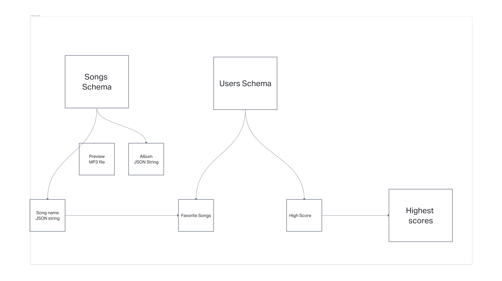
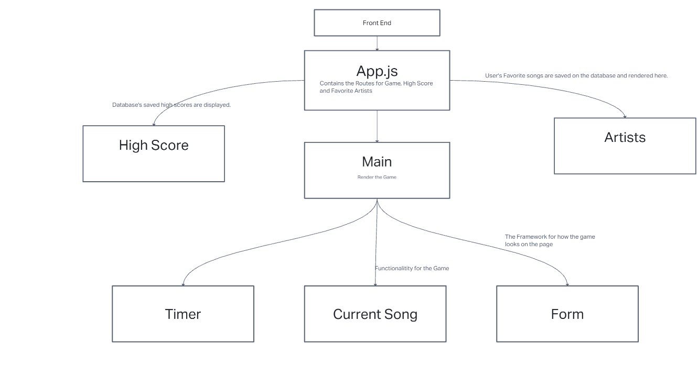
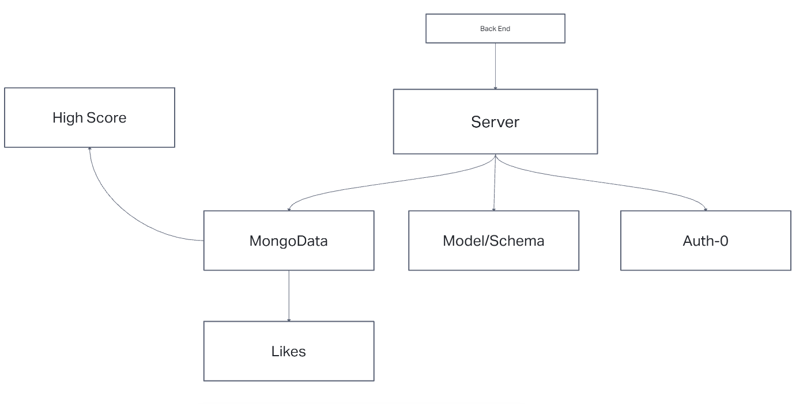
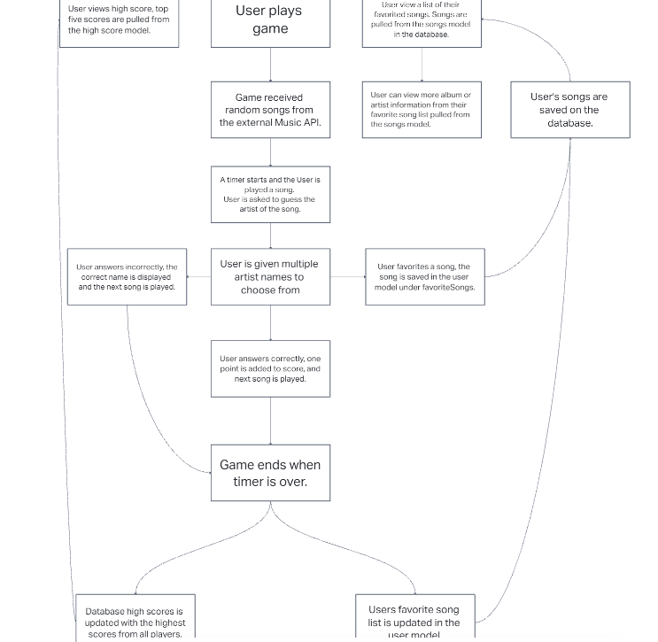

# TEAM-MAGENTA-Group-Project-Back-End

## Authors

Adrian Cosme-Halverson, Alfredo Orquiz, David Lee, Jordan Yamada

## Project Description

Back end for Code Fellows 301 project

## User Stories  

Compete with musically talented friends
Those users who want to play a game about music and are competing with musically talented people. Maybe they can not beat them on how to play the guitar, but they can beat them when comparing their scores from guessing the music.
The app's feature will contain a saving system of the music when the music pops up, and the User can save it and study for the next round. The scoring system will also be available to compete with other users. The feature will also contain playing a game where the User has to guess the title, music, and artist.
We will ensure that the schedule will not conflict with the SERVER hosts and that all the team members will not be in conflict.

Music Trivia Game
For Users who want to play a game of Music Trivia and are sick of playing the same old music list, this app is for them. This app will be updated when the Music API is updated to ensure new music daily. 
The feature task will be to guess a song when the music is played and has the option of assuming who the artist is or the title of the piece.
We will ensure that the schedule will not conflict with the SERVER hosts and that all the team members will not be in conflict.

Do you know who this is?
Those users who want to update their playlist with modern top 100 songs. It will pick a random piece within the top 100 and present it to the User.
The feature will request the top 100 hits from the music API. The app will also have the option of guessing who the artist is or the music title for the User. Also, the app will provide the info if the User wants to know who the artist is or what the song is.
We will ensure that the schedule will not conflict with the SERVER hosts and that all the team members will not be in conflict.

What song is this
Those users who want to update their playlist with modern top 100 songs. It will pick a random piece within the top 100 and present it to the User.
The feature will request the top 100 hits from the music API. The app will also have the option of guessing who the artist is or the music title for the User. Also, the app will provide the info if the User wants to know who the artist is or what the song is.
We will ensure that the schedule will not conflict with the SERVER hosts and that all the team members will not be in conflict.

New song me
Users who are sick of listening to their old playlist and want to update their playlist with modern top 100 music are welcome. They would not be required to remember the music because one of the features of the app will contain a saving system for the music
The feature of the app will be being able to save the songs that are presented to the User. The top 100 pieces of music will be picked, and their data will be presented with the title, the music, and the artist's information.
We will ensure that the schedule will not conflict with the SERVER hosts and that all the team members will not be in conflict.

## White Boards  

Schema Models  

Wireframes

Domain Models

